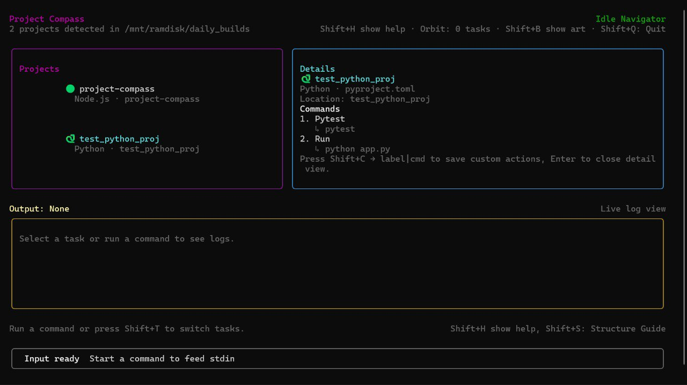
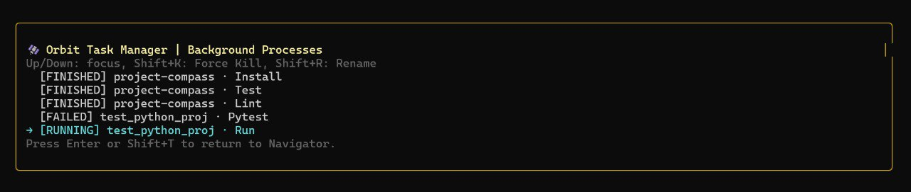
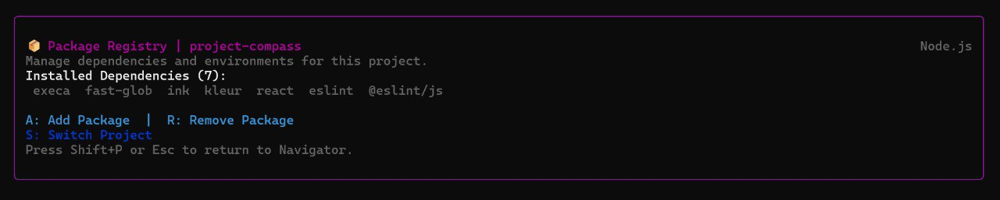
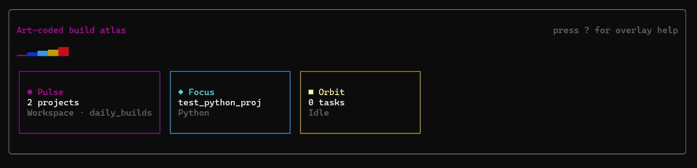

# 🧭 Project Compass

**Futuristic Project Navigator & Runner for the Modern Developer**

Project Compass is a high-performance, TUI (Terminal User Interface) workspace orchestrator built with Ink and React. It transforms your terminal into a command center for managing complex, multi-stack environments with a focus on speed, safety, and visual clarity.



## 🌟 Premium Features

### 🌌 The Navigator (Main Interface)
- **Automatic Discovery**: Instantly scans and identifies Node.js, Python, Rust, Go, Java, Scala, PHP, and Ruby projects.
- **Deep Detail View**: Press `Enter` to reveal project manifests, detected frameworks, and available scripts.
- **Custom Actions**: Save persistent, project-specific commands with `Shift+C` (e.g., `deploy|npm run deploy --prod`).
- **Live Output Panel**: Stream real-time logs from active processes with dedicated scrolling (`Shift+↑/↓`).

### 🛰️ Orbit Task Manager (`Shift+T`)
- **Background Orchestration**: Keep tasks running while you navigate the rest of your workspace.
- **Process Management**: Monitor status (Running, Finished, Failed, Killed) and forcefully terminate processes with `Shift+K`.
- **Task Identity**: Rename tasks on the fly with `Shift+R` to keep your workspace organized.



### 📦 Package Registry (`Shift+P`)
- **Context-Aware Management**: Add or remove dependencies without leaving the app.
- **Internal Switcher**: Quick-swap projects within the registry view using `S`.
- **Multi-Runtime Support**: Handles `npm`, `pip`, and more based on project type.



### 🏗️ Project Architect (`Shift+N`)
- **Rapid Scaffolding**: Create new projects from scratch using industry-standard templates.
- **Interactive Prompts**: Safe, guided setup for directory structure and initial manifests.

### 🎨 Omni-Studio & Art Board
- **Environment Health (`Shift+A`)**: Audit your system dependencies and runtime versions.
- **Build Atlas (`Shift+B`)**: A visual, art-coded representation of your project landscape.



## ⌨️ Command Reference

| Shortcut | Action |
| :--- | :--- |
| `↑ / ↓` | Move project focus |
| `Enter` | Toggle project Detail View |
| `Shift + T` | **Orbit**: Task Manager |
| `Shift + P` | **Registry**: Package Manager |
| `Shift + N` | **Architect**: Project Creator |
| `Shift + A` | **Studio**: Environment Health |
| `Shift + B` | Toggle **Art Board** visibility |
| `Shift + H` | Toggle **Help Cards** |
| `Shift + S` | Toggle **Structure Guide** |
| `Shift + Q` | Quit (with safe-exit confirmation) |
| `?` | Toggle Help Overlay |

## 🛠️ Installation

```bash
npm install -g project-compass
```

## 🚀 Vision
Project Compass is designed to be the "Last Terminal Tool" you ever need to open. It bridges the gap between raw CLI commands and full IDEs, giving you a professional, reactive cockpit for all your development work.

---
**Crafted with ❤️ by Satyaa & Clawdy**
*MIT License*
